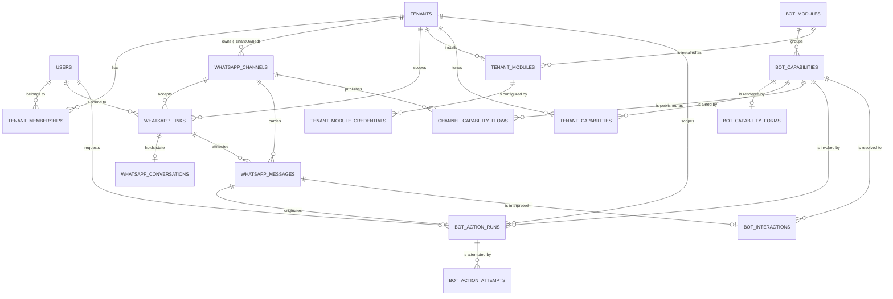

# WhatsApp Bot — Specification

**Status:** Proposed for approval  
**Date:** 2026-08-31  
**Related decisions:** [ADR-005](../../decisions/ADR-005-Adopt-WhatsApp-Delivery-Channel.md), [ADR-006](../../decisions/ADR-006-Bot-Capability-Catalog-And-Modules.md)  
**Depends on:** [identity-access](../identity-access/SPEC.md) first increment

## 1. Objective

Add WhatsApp as a second delivery channel for the multitenant product. An identified person operates the product by message; a language model routes free-form text to a closed catalog of capabilities; reads answer immediately and effects require explicit confirmation. The same channel model accommodates organization-owned WhatsApp accounts connected through Meta Embedded Signup without a second implementation.

This specification adds a channel and a capability catalog. It does not add business rules: every capability projects onto an Application request that already exists and is already authorized.

### 1.1 Audiences

A channel declares which audiences it serves, and an audience determines the entire authorization story for a message. There are exactly three, and they are not interchangeable.

| Audience | Who writes | Tenant comes from | Identity | Authorization | Catalog |
|---|---|---|---|---|---|
| `Members` | a member of a client organization | the verified link | `ApplicationUser` | membership permissions | internal operations |
| `Personal` | an individual acting for themselves | the verified link | `ApplicationUser` | their own `Personal` tenant | personal operations, including invoicing |
| `Contacts` | a customer of a client organization | **the channel itself** | none in platform identity | row scope only, never permissions | that organization's contact catalog, read-mostly |

The platform-owned channel serves `Members` and `Personal`. An organization-owned channel serves `Contacts`: it is the assistant that organization offers its own customers, on its own number and brand.

`Members` and `Personal` are identified people holding verified links. A `Contacts` interlocutor is not a platform identity and never becomes one: the tenant is fixed by the channel, and what that person may see is bounded by their own rows in that organization's data — an order they placed, an appointment they hold — never by a permission grant.

This is why WA-REQ-052 makes audience exposure a property of the capability itself. Invoicing declares `Members | Personal`, so it is structurally unreachable from a `Contacts` channel; no configuration mistake can expose it.

The `Personal` audience depends on the identity-access `Personal` tenant slice (IA-010) and its PII policy. The `Contacts` audience is a separate product surface and is scoped out of this increment entirely.

## 2. Scope

### 2.1 First increment

1. provision one `PlatformOwned` channel and administer it from the Platform panel;
2. link a member's phone from an authenticated web session and confirm it from the phone;
3. receive, verify, deduplicate, and asynchronously process inbound messages;
4. reject any sender absent from the allowlist without consuming model tokens;
5. resolve identity, tenant, and effective permissions per message;
6. route a natural-language question to a `Query` capability and answer it;
7. execute a reversible `Action` capability through the two-phase confirmation flow;
8. administer channel, links, capabilities, and monitoring from the Platform panel.

### 2.2 Roadmap outside the first increment

- self-service enrollment and `Personal` tenants on the platform channel, which depend on IA-010 and its PII policy;
- Embedded Signup and `TenantOwned` channels;
- WhatsApp Flows as a capability rendering, and the encrypted data endpoint;
- the ARCA electronic-invoicing module and any other irreversible module;
- media inbound (audio, image) and document outbound;
- conversational components (ice breakers, commands, welcome message).

Until the applicable controls are complete, the product must not claim WhatsApp availability for irreversible operations.

### 2.3 Explicit non-goals

The channel does not implement model-authored statements, a second authorization model, tenant selection from message content, business logic inside published Flow definitions, unattended irreversible effects, or delivery through any transport other than the Cloud API.

## 3. Domain language

| Term | Meaning in this project |
|---|---|
| Channel | One WhatsApp Business Account and phone number the platform can send from |
| Link | A verified binding of one phone number to one identity within one tenant |
| Conversation | Per-number state: active tenant, service window, recent turns |
| Capability | A declared thing the assistant may do, of kind `Query` or `Action` |
| Module | A group of capabilities sharing credentials and an integration contract |
| Run | One durable action intent, from draft through confirmation to outcome |
| Attempt | One execution or reconciliation of a run against an external system |
| Service window | The 24 hours after an inbound message, during which free-form replies are allowed |
| Reconciliation | Asking an external system whether an effect already occurred |

`TenantId` retains its ADR-004 meaning. `wa_id` is Meta's sender identifier; it is data, never an authority.

## 4. Normative requirements

### Channel and provisioning

- **WA-REQ-001:** every channel record carries `Mode` (`PlatformOwned` or `TenantOwned`), an owning tenant that is null exactly when the mode is `PlatformOwned`, a self-service flag, WABA identifier, phone number identifier, display number, Graph API version, and lifecycle status. Exactly one `PlatformOwned` channel may be active per product line. A `TenantOwned` channel MUST have an owning tenant and MUST NOT enable self-service.
- **WA-REQ-002:** channel credentials — application secret, access token, verify token — are persisted only as encrypted envelopes with a key version, never as readable columns. A written secret is never returned by any endpoint or projection; the panel displays only a non-reversible suffix.
- **WA-REQ-003:** the platform never depends on a temporary dashboard token. The access token MUST originate from a system user with non-expiring credentials, and the panel MUST surface token validity through an explicit connectivity check.
- **WA-REQ-004:** channel administration requires an active Platform tenant, an explicit `platform.whatsapp.*` permission, and recent MFA step-up for mutations, through the ADR-004 evaluator. No channel capability exists outside that evaluator.
- **WA-REQ-005:** inbound routing resolves the channel from the WABA identifier of the event, never from configuration assumed to be singular. An event for an unknown or suspended channel is recorded and discarded without processing.
- **WA-REQ-006:** channel health — quality rating, messaging tier, webhook subscription state, credential validity — is persisted and observable. A channel whose credentials fail verification transitions to `Suspended` and stops sending.

Provider-derived setup state and degradation alerting are specified in WA-REQ-055 and WA-REQ-056.

### Linking and identification

- **WA-REQ-007:** a link binds `(ChannelId, WaId)` to exactly one `(UserId, TenantId)` pair and carries a lifecycle status and a kind. At most one link may be `Active` per `(ChannelId, WaId, TenantId)`, so one number may hold one link per context under WA-REQ-054, and never two in the same context.
- **WA-REQ-008:** a link is created only by an authenticated request carrying a validated active tenant under IA-REQ-006. The tenant and identity are taken from the session; a submitted tenant or identity is rejected. Self-service enrollment under WA-REQ-049 is the only other path to an active link, and it reaches the same authenticated state before activating.
- **WA-REQ-009:** activation requires an inbound message from the bound number carrying a single-use verification code. Only the code hash and its expiry are persisted. An expired, reused, mismatched, or wrong-sender code never activates a link.
- **WA-REQ-010:** an administrator may create a link on behalf of a member, but that link is created `Pending` and follows the same confirmation path. No administrative action activates a link without an inbound confirmation from the number.
- **WA-REQ-011:** the inbound message that activated a link is retained as opt-in evidence for the life of the link and is reproducible in audit.
- **WA-REQ-012:** every message revalidates the link, the tenant, and the membership. A revoked link, a suspended membership, a suspended tenant, or a disabled identity ends processing regardless of prior state, consistent with IA-REQ-008.
- **WA-REQ-013:** phone numbers are normalized to a canonical form on write and on lookup. Lookup MUST match national variants that WhatsApp reports differently from user-entered input; a link that cannot be matched canonically MUST NOT be created.

### Inbound processing

- **WA-REQ-014:** the webhook verification request answers Meta's challenge only when the supplied verify token matches the channel's stored value in constant time.
- **WA-REQ-015:** every inbound event is authenticated by an HMAC-SHA256 signature computed over the exact raw request body with the channel's application secret, compared in constant time. A missing, malformed, or non-matching signature is rejected without persistence and without processing.
- **WA-REQ-016:** the endpoint carries the explicit `IPublicRequest` marker of IA-REQ-011. Its signature check, not HTTP metadata, is its authorization.
- **WA-REQ-017:** the receiver persists the event and acknowledges `200` before any business processing. Business failures never change the acknowledgement.
- **WA-REQ-018:** inbound events are deduplicated by provider message identifier under a unique constraint. A replayed identifier produces no additional processing and no additional effect.
- **WA-REQ-019:** ordering is derived from the provider timestamp, never from arrival order.
- **WA-REQ-020:** a sender without an `Active` link never reaches a model invocation and never reaches a capability. The rejection is recorded and repeated unknown senders are rate limited per number. The reply depends on the channel's declared audience under WA-REQ-050.

### Outbound

- **WA-REQ-021:** every outbound message is written to the transactional outbox in the same transaction as the business change that caused it, under IA-REQ-027, and delivered with the outbox message identifier as the provider idempotency key.
- **WA-REQ-022:** the service window is tracked per conversation. A free-form reply outside the window is refused by the sender rather than attempted, and only an approved template may be sent.
- **WA-REQ-023:** the provider message identifier returned on delivery is persisted as delivery evidence. Delivery and read receipts update the outbound record and never create one.

### Capability catalog

- **WA-REQ-024:** capabilities are declared in a catalog with a stable code, an owning module, a kind, a description, a parameter schema, a required permission, a reversibility flag, and a default confirmation mode. The catalog is synchronized idempotently from code, as the permission catalog is under IA-REQ-009.
- **WA-REQ-025:** a `Query` capability may dispatch to a declarative parameterised statement or to a request type. An `Action` capability MUST dispatch to a request type and MUST NOT carry a declarative statement. A database constraint enforces this.
- **WA-REQ-026:** a declarative statement receives the validated `TenantId` from the resolved link, injected by the server. A statement that does not filter by that tenant MUST fail catalog validation and MUST NOT be activatable.
- **WA-REQ-027:** the language model receives only capability names, descriptions, and parameter schemas. It never receives connection details, statements, identifiers of other tenants, or credentials, and its output is treated as a proposal requiring validation.
- **WA-REQ-028:** the model's selection is validated before use: the capability exists, is active, is available to this tenant and channel, the caller holds its permission, and the parameters validate against the schema. Any failure ends in a declared outcome, never in a partially applied effect.
- **WA-REQ-029:** the catalog offered for a request is computed as the intersection of active capabilities, installed and enabled modules, valid module credentials, tenant-enabled capabilities, channel allowlist, and the caller's effective permissions. A capability failing any term is absent, not merely denied.
- **WA-REQ-030:** an organization may disable a capability, tighten its confirmation mode, cap its amount, cap its daily count, and restrict its channels, without code changes. An organization MUST NOT weaken a capability below the catalog default for an irreversible capability.
- **WA-REQ-031:** module credentials are stored per organization and per environment as encrypted envelopes validated against the module's declared schema, with a health state, an expiry, and a last-checked timestamp. Expiry is observable before it takes effect. A credential record also carries the non-secret configuration a module needs to operate — an issuing point of sale, an account identifier, a delegated tax identification — and a record missing any element its schema declares required MUST remain `Pending`. Only a health check that exercises the external system promotes a record to `Valid`; a record is never promoted because it was merely saved.
- **WA-REQ-032:** a request that resolves no capability produces a declared "not understood" outcome with an audit record. It never produces a guessed capability.

### Actions and execution

- **WA-REQ-033:** an `Action` creates a durable run before any effect, carrying the resolved parameters, a server-rendered summary, an idempotency key unique per tenant, a state, and an expiry.
- **WA-REQ-034:** every value presented for approval — amounts, taxes, totals, document types, counterparties, identifiers — is computed by the application and rendered from persisted data. A language model never produces a value the human is asked to approve.
- **WA-REQ-035:** execution requires an explicit confirmation referencing the run. An expired, already-confirmed, cancelled, or foreign-tenant run is refused. Confirmation of an irreversible capability defaults to an authenticated web session with antiforgery.
- **WA-REQ-036:** every external capability that performs a non-idempotent write implements both execution and reconciliation. A read-only external capability declares execution only. A module that cannot determine whether an effect already occurred MUST NOT declare an irreversible capability. Enablement is evaluated per capability, so a module MAY ship with only its read capabilities enabled and gain its write capabilities later.
- **WA-REQ-037:** each execution and each reconciliation is recorded as an attempt with its outcome. An outcome of `Unknown` MUST transition to reconciliation and MUST NOT be retried.
- **WA-REQ-038:** replaying a confirmation, a webhook, or a worker lease produces one effect. The idempotency key is the coordination mechanism; the unique constraint is a backstop.
- **WA-REQ-039:** every run records its actor, tenant, origin channel, originating message, rendered summary, outcome, and external reference in append-only audit under IA-REQ-026.

### Flows

- **WA-REQ-040:** a Flow definition is one rendering of a capability's parameter schema. It is versioned by checksum, published per channel, and its published checksum is compared against the definition to detect drift.
- **WA-REQ-041:** the flow token sent with a Flow message is the action run identifier. A submission whose token does not resolve to an open run for the sending link is refused.
- **WA-REQ-042:** derived and conditional values — required fields, document classification, computed totals — are produced by the application through the data endpoint. Published Flow definitions MUST NOT contain business or fiscal rules.
- **WA-REQ-043:** the Flow data endpoint authenticates and decrypts requests using channel-scoped key material stored under WA-REQ-031, and rejects any request it cannot verify.

### Security, audit, and contract

- **WA-REQ-044:** secrets, tokens, verification codes, raw provider payloads containing personal data, and message bodies MUST NOT appear in logs, Problem Details, audit records, or telemetry. Message content is retained only in its own table under documented retention.
- **WA-REQ-045:** channel permissions are the intersection of the membership's effective permissions and the channel allowlist. A channel never grants what the membership lacks.
- **WA-REQ-046:** every resolved message records how it was resolved — deterministically from an explicit intent, or by model invocation — together with its capability outcome and latency, and, when a model was invoked, its token usage and model identifier, without recording credentials. The ratio between the two paths is therefore measurable, which is what makes the cost of the assistant a number rather than an estimate.
- **WA-REQ-047:** all HTTP endpoints follow IA-REQ-038: endpoint-specific DTOs with semantic status on success, RFC 9457 Problem Details with stable codes on failure, and no universal envelope. Webhook acknowledgement is bodyless `200` and is exempt from Problem Details, since its consumer is Meta.

### Channel audience and self-service enrollment

- **WA-REQ-048:** every channel declares the audiences it serves. A `PlatformOwned` channel may serve `Members` and `Personal`. A `TenantOwned` channel may serve only `Contacts`, and every message on it resolves to that channel's own tenant. A channel MUST NOT serve `Members` or `Personal` for a tenant other than through a verified link, and MUST NOT mix `Contacts` with either of the other two.
- **WA-REQ-049:** a self-service channel may accept an unknown sender as a phone claim. A claim carries no tenant, no identity, no membership, and no capability, and can perform nothing. The assistant may collect business data against that claim, but the claim becomes an `Active` link only when a web registration has created the identity, confirmed its email under IA-REQ-005, and created its `Personal` tenant. An unconfirmed, abandoned, or expired claim is discarded and retains no collected data beyond its documented retention.
- **WA-REQ-050:** the reply to an unknown sender is determined by the channel's audience. A channel that does not accept self-service returns a fixed message revealing nothing about the platform or its organizations. A self-service channel may return an enrollment invitation. Neither reply discloses whether any number, identity, or organization exists.
- **WA-REQ-051:** a `Personal` tenant reaches only capabilities scoped to itself. Membership of an organization never widens what a `Personal` link may do, and a `Personal` link never reaches organization data, in either direction.
- **WA-REQ-052:** every capability declares the audiences it is exposed to. The resolution chain of WA-REQ-029 intersects that declaration with the audience of the current message, so a capability not declared for an audience is never offered and never selectable. Any capability that issues a fiscal document, moves money, or reads organization-wide data MUST NOT declare the `Contacts` audience. An architecture test enforces this for every irreversible capability.
- **WA-REQ-053:** a `Contacts` message is authorized by row scope, never by permission. A capability serving `Contacts` receives the channel's tenant and the sender's phone number, and MUST restrict every result to rows that phone number owns within that tenant. It MUST NOT accept a record identifier from the message or from the model as its sole scoping term, and it MUST NOT expose aggregate, cross-customer, or organization-internal data.
- **WA-REQ-054:** one phone number may hold an active link in more than one tenant — typically an organization membership and the person's own `Personal` tenant. The conversation carries exactly one active tenant, resolved from a single link, and the offered catalog is built for that context alone; permissions are never accumulated across contexts, preserving IA-REQ-007. Switching context is explicit and is offered automatically once a second active link exists. When a capability is enabled in more than one of that person's contexts, the rendered summary of WA-REQ-034 MUST name the acting tenant, and confirmation MUST NOT be skipped regardless of the capability's default. The issuing party is therefore always present in the text the person approves, so a sticky context cannot silently produce an effect under the wrong tenant.

### Channel observability

- **WA-REQ-055:** channel setup state is derived from the provider, never from operator memory. The platform queries and persists, per channel: phone number registration and display-name status, whether this application is subscribed to the business account, business verification and account review state, quality rating, and messaging tier. Each item records the outcome and the time of its last check. An item that cannot be verified is reported as **unknown** and never as satisfied, because a setup step silently assumed complete is the failure mode this requirement exists to prevent — an unsubscribed application accepts configuration, reports health, and delivers no events at all.
- **WA-REQ-056:** any transition that reduces a channel's ability to operate — failed credential verification, quality downgrade, messaging-tier reduction, lost application subscription, account restriction, or a module credential reaching expiry — raises an alert written to the transactional outbox in the same transaction as the state change, under IA-REQ-027. An alert declares the permission that identifies its recipients rather than an address, is deduplicated per channel and condition so a persistent fault does not repeat indefinitely, and is cleared when the condition resolves. Silence therefore means healthy, not unobserved.

- **WA-REQ-057:** deterministic resolution precedes interpretation. An inbound message that carries an explicit intent — a reply-button identifier, a list selection, or a flow submission — resolves its capability and its parameters from that identifier and its payload, and **MUST NOT** invoke a language model. The model is invoked only for free-form input that carries no explicit intent, and for media that must first be transcribed or read. An invocation that could have been resolved deterministically is a defect, not an inefficiency: it spends money and adds latency to a decision that was already made when the person tapped.

  Determinism is not trust. A returned identifier originates in the client and MUST be validated exactly as a model selection is under WA-REQ-028: it must reference something this server issued into this conversation, its capability must still pass the full resolution chain of WA-REQ-029, and its payload must validate against the capability's parameter schema. Authorization is never skipped; only interpretation is.

  Both paths converge before any effect. A capability reached deterministically is subject to the same confirmation rules, including the acting-tenant disclosure of WA-REQ-054 — tapping a button is not itself an approval of a summary the person has not seen.
## 5. Data model

Fourteen new tables. No identity-access table is altered; only the references that cross into them are shown.



### 5.1 Aggregates

- `WhatsAppChannel`: mode, provider identifiers, encrypted credentials, health, lifecycle.
- `WhatsAppLink`: the allowlist entry — phone, identity, tenant, verification, lifecycle, opt-in evidence.
- `WhatsAppConversation`: service window, active tenant for multi-membership numbers, recent turns.
- `WhatsAppMessage`: inbound and outbound, deduplicated by provider identifier.
- `BotModule` / `BotCapability` / `BotCapabilityForm`: the code-owned catalog.
- `TenantModule` / `TenantModuleCredential` / `TenantCapability`: per-organization installation, secrets, and limits.
- `ChannelCapabilityFlow`: per-channel Flow publication and drift state.
- `BotActionRun` / `BotActionAttempt`: durable intent and its observable execution history.
- `BotInteraction`: one model invocation, its routing outcome, and its cost.

### 5.2 Persistence invariants

- **WA-INV-001:** partial unique index on active links per `(ChannelId, WaId, TenantId)`. One phone number may hold one active link per tenant, so an identity that both works for an organization and acts for itself links the same number in both contexts.
- **WA-INV-002:** unique index on provider message identifier.
- **WA-INV-003:** unique index on `(TenantId, IdempotencyKey)` for runs.
- **WA-INV-004:** partial unique index on non-terminal credentials per `(TenantId, ModuleCode, Environment)`.
- **WA-INV-005:** composite foreign keys carrying `TenantId` on every tenant-scoped association, so PostgreSQL rejects cross-tenant combinations, extending IA-REQ-034.
- **WA-INV-006:** the `Query`/`Action` dispatch constraint of WA-REQ-025 is a table check constraint.
- **WA-INV-007:** no cascade deletes reach links, messages, runs, attempts, or interactions; they are history.
- **WA-INV-008:** runs and credentials carry a concurrency token; a lost update becomes `409` under IA-REQ-035.
- **WA-INV-009:** mutable business tables derive from `BaseAuditableEntity` and are populated by the existing save interceptor. Append-only tables derive from `BaseEntity` and MUST NOT carry modification columns, because a modification column on an immutable log asserts a capability that does not exist. Composite-key association tables carry neither; their changes are recorded as `AuditEvent` records under IA-REQ-026. Section 5.3 classifies every table.
- **WA-INV-010:** the ambient actor used by the save interceptor is populated for every execution context, including background processing that has no HTTP context. A row written while resolving an inbound message records the identity resolved from its link as its actor; a row written by a worker with no human actor records a declared system principal. An unattributed audited row is a defect, not an accepted default.
- **WA-INV-011:** entity identifiers are UUID. Sequential integer keys MUST NOT be used for tenant-scoped rows, because they disclose volume and ordering across tenant boundaries.

### 5.3 Audit classification

`BaseAuditableEntity` records the provenance of the **current** state and is overwritten on every update. `AuditEvent` records the **fact** that something changed and is append-only. They answer different questions and both are required; neither substitutes for the other.

| Group | Base | Tables |
|---|---|---|
| Mutable business state | `BaseAuditableEntity` | `whatsapp_channels`, `whatsapp_links`, `whatsapp_conversations`, `tenant_modules`, `tenant_module_credentials`, `tenant_capabilities`, `channel_capability_flows`, `bot_action_runs` |
| Append-only history | `BaseEntity` | `whatsapp_messages`, `bot_action_attempts`, `bot_interactions` |
| Code-owned catalog | `BaseEntity` | `bot_modules`, `bot_capabilities`, `bot_capability_forms` — synchronized from code, so deployment is their provenance |

The catalog tables are audited by the synchronization record, not per row: a capability's history is its commit history. Association tables introduced by any module follow the third rule of WA-INV-009.

### 5.4 Tenant scoping classification

Not every table is tenant-scoped, and the ones that are not are not defects. What would be a defect is leaving the distinction implicit, because a reader then cannot tell an intentional global table from a missing filter. Every table belongs to exactly one of three groups.

**Tenant-scoped.** Carries `TenantId`, is filtered by the validated tenant on every read under IA-REQ-012, and participates in the composite foreign keys of WA-INV-005.

`whatsapp_links` · `tenant_modules` · `tenant_module_credentials` · `tenant_capabilities` · `bot_action_runs` · `bot_action_attempts` · `bot_interactions`

**Global by design.** Holds no tenant business data. A global row is identity, catalog, or configuration, and its contents are the same for every organization.

`bot_modules` · `bot_capabilities` · `bot_capability_forms` — the code-owned catalog, synchronized under WA-REQ-024.

**Deliberately partial.** Tenancy is absent or nullable for a stated reason, and each carries its own compensating rule.

| Table | Why | Compensating rule |
|---|---|---|
| `whatsapp_channels` | the platform channel belongs to no organization | `TenantId` is null exactly when the mode is `PlatformOwned`; a `TenantOwned` channel MUST have one |
| `whatsapp_messages` | a message from an unresolved sender genuinely has no tenant | attribution is nullable; an unattributed message is only ever readable through Platform projections, never through a tenant-scoped query |
| `whatsapp_conversations` | `Contacts` conversations have no link | the conversation MUST carry a resolved `TenantId`, taken from the link for `Members` and `Personal` and from the channel for `Contacts`; it is never null |
| `channel_capability_flows` | keyed by channel, which may be platform-owned | inherits the channel's tenancy; publication state is not tenant data |

- **WA-INV-012:** every table belongs to exactly one group above, and the classification is asserted by an architecture test. A tenant-scoped table without `TenantId`, a global table that acquires tenant business data, or a partial table without its compensating rule each fail that test.
- **WA-INV-013:** `bot_action_attempts` carries `TenantId` denormalized from its run and constrained by a composite foreign key. Reaching an attempt's tenancy through a join is not sufficient: the Platform projections, the retention job, and the reconciliation worker all query attempts directly, and each of those is a place a missing join becomes a cross-tenant read.

### 5.5 Dependency on identity-access tenancy

Two assumptions this specification makes about ADR-004 tables have not been confirmed there, and are recorded as findings rather than silently assumed:

1. **`OutboxMessage` needs tenant attribution.** The bot writes every reply through the outbox under WA-REQ-021. Without a tenant on the message, per-tenant delivery observability, the Platform projections of WA-REQ-044, and retention cannot be expressed, and the delivery worker has no tenant context to log. If identity-access does not add it, WA-005 must.
2. **`PersonProfile` visibility is unresolved.** It holds CUIT and identity-document data for a person who may also be a member of organizations. Whether an organization administrator may ever see a member's profile is not answered by ADR-004, and the `Personal` audience makes the question live. It belongs to IA-010 and its PII policy, and gates WA-014.

## 6. Initial HTTP contract

Routes are contractual drafts; generated OpenAPI becomes the source of truth.

| Method and route | Access | Primary result |
|---|---|---|
| `GET /api/whatsapp/webhook` | Public + verify token | `200` challenge echo |
| `POST /api/whatsapp/webhook` | Public + valid signature | bodyless `200` always |
| `POST /api/whatsapp/flows/data` | Public + channel key material | encrypted screen payload |
| `POST /api/whatsapp/links` | Authenticated + antiforgery | `201` link DTO with verification code |
| `DELETE /api/whatsapp/links/{id}` | Authenticated or `whatsapp.links.manage` + antiforgery | bodyless `204` |
| `GET /api/whatsapp/links` | `whatsapp.links.read` | `200` typed `{ items, nextCursor }` |
| `GET /api/bot/runs/{id}` | Authenticated, own tenant | `200` run DTO with rendered summary |
| `POST /api/bot/runs/{id}/confirm` | Authenticated + antiforgery + capability permission | `200` run DTO or Problem Details |
| `POST /api/bot/runs/{id}/cancel` | Authenticated + antiforgery | bodyless `204` |
| `GET /api/platform/whatsapp/channel` | `platform.whatsapp.read` | `200` channel DTO, secrets masked |
| `PUT /api/platform/whatsapp/channel` | `platform.whatsapp.configure` + recent MFA | `200` channel DTO |
| `POST /api/platform/whatsapp/channel/verify` | `platform.whatsapp.configure` | `200` connectivity DTO |
| `GET /api/platform/whatsapp/channel/setup` | `platform.whatsapp.read` | `200` setup-checklist DTO: per item, outcome, last check |
| `POST /api/platform/whatsapp/channel/setup/refresh` | `platform.whatsapp.configure` | `200` refreshed setup-checklist DTO |
| `GET /api/platform/bot/capabilities` | `platform.bot.capabilities.read` | `200` typed `{ items, nextCursor }` |
| `PUT /api/tenants/{tenantId}/bot/capabilities/{code}` | `bot.capabilities.manage` + antiforgery | `200` settings DTO |
| `PUT /api/tenants/{tenantId}/bot/modules/{code}/credentials` | `bot.modules.manage` + recent MFA | bodyless `204` |

## 7. Permissions introduced

`whatsapp.links.read`, `whatsapp.links.manage`, `bot.capabilities.manage`, `bot.modules.manage`, `platform.whatsapp.read`, `platform.whatsapp.configure`, `platform.bot.capabilities.read`, `platform.bot.capabilities.manage`. Each follows IA-REQ-009 and is defined in code.

## 8. Test strategy

- **Domain:** link lifecycle, run state machine, service window, capability resolution.
- **Application:** routing validation, permission intersection, two-phase invariants, idempotency, "not understood" outcomes, with TDD.
- **Functional:** use case, pipeline, EF Core, real PostgreSQL, including cross-tenant and replay matrices.
- **Infrastructure:** signature verification against captured raw bodies, phone normalization, encrypted envelopes, outbox delivery, reconciliation on `Unknown`.
- **HTTP:** webhook challenge and rejection, Problem Details, OpenAPI drift.
- **Model routing:** a fixture set of questions asserting the selected capability and parameters, run on catalog change.
- **Architecture:** no capability bypasses `AuthorizationBehaviour`; no `Action` carries a declarative statement; no module declares an irreversible capability without reconciliation.

Minimum matrix per capability: unlinked sender; revoked link; suspended membership; suspended tenant; missing permission; capability disabled for tenant; channel not allowed; expired module credentials; replayed message; replayed confirmation.

## 9. Acceptance criteria

```gherkin
Scenario: An unlinked number never reaches the model
  Given a number with no active link on the channel
  When it sends a message
  Then the response is the fixed non-revealing message
  And no model invocation is recorded
  And the message is recorded as rejected

Scenario: Linking derives authority from the web session
  Given a member authenticated with Organization A as active tenant
  When the member requests a link and confirms the code from that phone
  Then the link binds that phone to that identity in Organization A
  And a submitted tenant or identity in the request is rejected

Scenario: A revoked membership ends the channel immediately
  Given an active link whose membership is then suspended
  When the number sends a message
  Then processing ends before capability resolution
  And the response reveals no organization data

Scenario: A replayed webhook produces one effect
  Given an inbound message already processed
  When Meta redelivers the same message identifier
  Then the acknowledgement is 200
  And no additional interaction, run, or outbound message exists

Scenario: A tapped button never invokes a model
  Given a person taps a reply button the assistant sent
  When the message is processed
  Then the capability resolves from the button identifier
  And no model invocation is recorded
  And the interaction records that it resolved deterministically

Scenario: A completed flow carries its own parameters
  Given a person completes a flow the assistant sent
  When the submission arrives
  Then the parameters come from the submission and not from a model
  And the flow token resolves to an open run for that link
  And the parameters are validated against the capability schema before use

Scenario: A forged identifier is refused like any other input
  Given an inbound reply carrying an identifier this server never issued into this conversation
  When the message is processed
  Then the capability does not resolve
  And no effect occurs

Scenario: The catalog excludes capabilities whose module is unconfigured
  Given a capability belonging to a module with expired credentials
  When a permitted member asks for it
  Then the capability is absent from the offered catalog
  And the outcome is not understood rather than a failed execution

Scenario: A query cannot escape its tenant
  Given a member of Organization A with the reporting permission
  When the member asks a question resolving to a declarative query
  Then the executed statement is filtered by Organization A
  And no parameter supplied by the model can change that filter

Scenario: An action requires confirmation of a server-rendered summary
  Given a member invokes a reversible action by message
  When the assistant replies
  Then a run exists in draft with a rendered summary
  And no effect has occurred
  And the summary values were computed by the application

Scenario: A confirmed run executes once
  Given a draft run for a reversible action
  When the member confirms it twice
  Then exactly one effect exists
  And the second confirmation is refused as already confirmed

Scenario: An unknown outcome reconciles instead of retrying
  Given an external execution whose result could not be observed
  When the worker resumes the run
  Then it records a reconciliation attempt
  And it performs no second execution before reconciliation resolves

Scenario: An expired run cannot be confirmed
  Given a draft run past its expiry
  When the member confirms it
  Then the API returns stable Problem Details
  And no effect occurs

Scenario: An unsigned webhook is discarded
  Given an inbound request without a valid signature
  When the receiver handles it
  Then it is rejected without persistence
  And no acknowledgement implies acceptance

Scenario: An unsubscribed application is reported, not assumed
  Given a channel whose credentials are valid and whose number is registered
  And this application is not subscribed to the business account
  When the setup checklist is read
  Then the subscription item reports not satisfied
  And the channel is not presented as ready to receive

Scenario: A setup item that cannot be checked is unknown
  Given the provider is unreachable when the checklist refreshes
  When the checklist is read
  Then the affected items report unknown with the time of the last successful check
  And no item reports satisfied on the strength of a previous result alone

Scenario: Degradation raises exactly one alert until it clears
  Given a channel whose quality rating is downgraded
  When the state change is persisted
  Then one alert is written to the outbox in the same transaction
  And a repeated check of the same condition writes no further alert
  And resolution of the condition clears it

Scenario: Channel secrets are never readable
  Given a configured channel
  When any endpoint or projection returns channel data
  Then no application secret, access token, or verify token is present

Scenario: Invoicing is unreachable from a customer-facing channel
  Given a TenantOwned channel serving the Contacts audience
  And the invoicing capability declares only the Members and Personal audiences
  When a customer of that organization asks to issue an invoice
  Then the capability is absent from the offered catalog
  And no configuration of that organization can expose it

Scenario: A customer sees only their own rows
  Given a Contacts channel belonging to Organization A
  When a customer asks about an order
  Then the answer is restricted to rows owned by that phone number within Organization A
  And an identifier supplied in the message never widens that scope
  And no aggregate or organization-internal data is reachable

Scenario: The acting tenant is visible in what the person approves
  Given an identity with a membership in Organization A and its own Personal tenant
  And the invoicing capability is enabled in both contexts
  When the identity requests an invoice by message
  Then the rendered summary names the acting tenant
  And confirmation is required regardless of the capability's default
  And the offered catalog was built for one context only

Scenario: An unattributed message never reaches a tenant query
  Given a message from a sender that resolved to no tenant
  When any tenant-scoped query runs for any organization
  Then that message is absent from every result
  And it is reachable only through a Platform projection

Scenario: Attempts carry their own tenancy
  Given a run belonging to Organization A with several attempts
  When the retention job, a Platform projection, or the reconciliation worker queries attempts directly
  Then every result is filtered by tenant without joining to the run
  And a foreign-tenant attempt cannot be associated with that run

Scenario: Audiences never mix on one channel
  Given a channel declaring the Contacts audience
  When a Members or Personal link is created on it
  Then the association is rejected
  And no message on that channel resolves through a link

Scenario: A phone claim can do nothing
  Given an unknown sender on a self-service channel
  When the sender interacts before completing web registration
  Then a claim exists with no tenant, identity, or capability
  And no capability is offered and no effect is possible

Scenario: Self-service enrollment completes in the web
  Given a phone claim holding collected business data
  When the person registers, confirms the email, and obtains a Personal tenant
  Then the claim becomes an active link bound to that identity and tenant
  And an abandoned or expired claim is discarded instead of activated

Scenario: A personal link never reaches organization data
  Given an identity with a Personal tenant and a membership in Organization A
  When the identity operates through a link bound to the Personal tenant
  Then only Personal-scoped capabilities are offered
  And no Organization A data is reachable in either direction
```

## 10. Decisions

Seven of the eight are resolved; each records what was decided, why, and what would reopen it. The eighth was opened by evidence that arrived after the others closed, and is left open deliberately.

**1 — One number, several contexts.** A phone number may hold one active link per tenant, so a person who works for an organization and also acts for themselves links once in each context. WA-REQ-054 and WA-INV-001 carry the mechanism: one active tenant per conversation, a catalog built for that context alone, and — for any capability enabled in more than one of that person's contexts — the acting tenant named in the summary the person approves, with confirmation never skipped. The sticky context is a convenience; the approved text is the safeguard.

**2 — `OutboxMessage` gains nullable tenant attribution in identity-access, at IA-008.** The table belongs to that feature, the bot is one of several future consumers, and a column added at creation costs nothing while one retrofitted onto populated production tables does. Nullable, because some messages precede any tenant.

**3 — Message content is retained indefinitely for now, as a deliberate choice with a review date.** No deletion job ships in the first increment. Two consequences are accepted rather than ignored: an individual deletion request under Argentine data-protection law is served by a manual procedure until a job exists, and stored volume grows without bound. The retention field and the job's seam are designed now so that a later contractual requirement becomes configuration, not a migration. Redaction is the intended first step when that day comes — the message record and its audit value survive while the body is cleared — and it is preferred over deleting rows, which would break the opt-in evidence chain of WA-REQ-011. Reopened by any client contract specifying a retention period, or by the first deletion request.

**4 — Azure Key Vault.** ASP.NET Core Data Protection keys are persisted to Azure Blob Storage and wrapped by a Key Vault key; module and channel credential envelopes are wrapped by the same key material. Access is by Managed Identity, so no secret exists in configuration to protect. Development and Test keep local Data Protection. Reopened only by a change of hosting platform.

**5 — An organization administrator never sees a member's `PersonProfile`.** Administration of members exposes membership, roles, status, and email confirmation, and nothing from the personal tenant. A person's identity document and tax identification belong to their own `Personal` tenant and are visible only to them. This is a firm boundary, not a default: an administrative screen that surfaces a member's profile fails the projection tests.

**6 — `claude-sonnet-5` at low effort for capability routing, on the minority of messages that need it.** Under WA-REQ-057 the model is invoked only for free-form input: a tapped button, a list selection, and a completed flow all resolve deterministically and cost nothing. In an assistant driven mostly through its interface, routing is the long tail rather than the common path, and the choice of model matters proportionally less than it first appears.

For that tail, routing is a classification-and-extraction task over a described catalog, not a reasoning task, and the two-phase confirmation of WA-REQ-033 means a routing miss costs a wasted turn rather than a wrong effect. The fixture set of section 8 is still built and still gates catalog changes: the model is chosen by measurement, and this is the starting point, not the conclusion. Because WA-REQ-046 records which path resolved each message, the real ratio is observable rather than assumed. A stage that genuinely reasons — extracting fields from a photographed document, for one — is a separate stage and is chosen separately.

**7 — Nothing to decide; the model already allows it.** Channels are a table and links reference a channel, so adding a second phone number is a row, sharing the same WABA, application secret, and token, differing only in phone number identifier. Inbound routing already keys on that identifier. No architectural commitment is pending, and the operational question — whether a large organization warrants its own number — is answered when quality or volume makes it concrete.

**8 — Open: may a capability be invoked by an external event rather than by a person?** Every requirement here assumes a person initiates and, for anything irreversible, approves. A capability triggered by an incoming payment or an order — invoice what was just collected, with nobody writing anything — has no person in the loop and therefore no summary to approve, so the safeguard of WA-REQ-033 through WA-REQ-035 does not apply as written.

This is a different authorization shape, not a missing feature: a **standing authorization** configured once in the web, scoped to one source, with its own amount ceiling, daily ceiling, and revocation, replacing per-instance confirmation. The pieces already exist — `TenantCapability` carries limits, the run and its attempts carry idempotency and reconciliation, and the audit trail is unchanged — but the trigger, the standing grant, and its review are unspecified.

It is deliberately left open rather than designed on assumption, because whether the product wants unattended issuing at all is a business decision with real exposure: an automation that misfires issues real fiscal documents nobody asked for, and every one of them needs a credit note. It blocks any event-triggered module and nothing in the current increment. Whoever resolves it should decide, at minimum: which sources may trigger, whether the grant expires, what the ceilings are, and what the person sees after the fact.

## 11. Definition of Done per slice

Inherits the identity-access definition, and adds: signature verification proven against a captured raw body; replay proven for webhook, confirmation, and worker lease; the cross-tenant matrix covered; secrets absent from every projection and log; the model routing fixture green; and any external module proven to reconcile before it may declare an irreversible capability.
