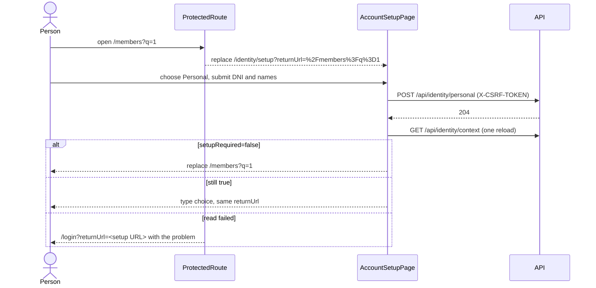
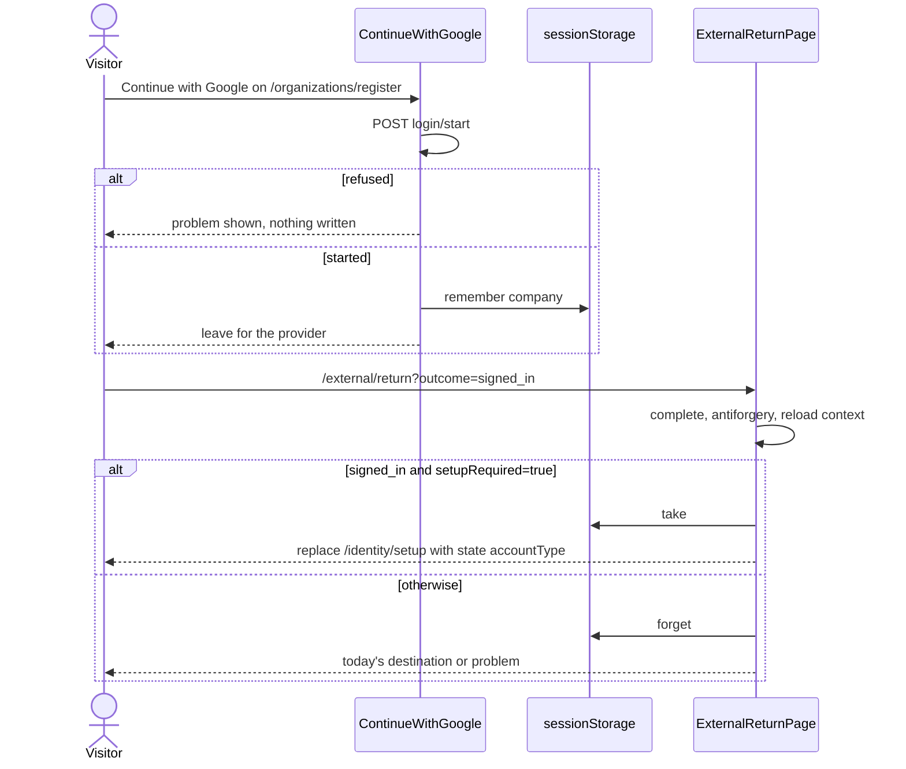
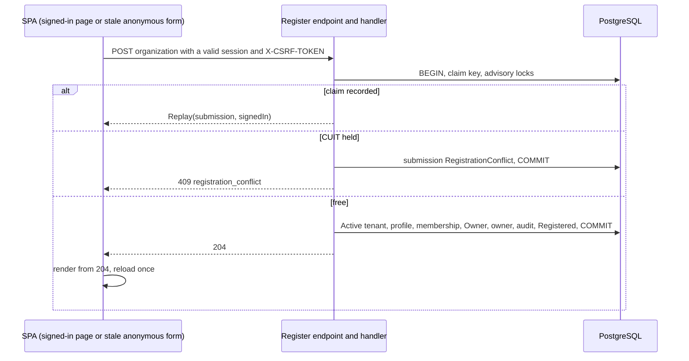

# Design: Account Setup Onboarding

## Technical Approach

This design implements the delta specs `identity-context-contract`, `account-setup`, `account-creation-entry` and
`identity-access` (IA-REQ-003/048, 004, 005) under pre-proposal revision 3.

- The server derives `setupRequired` in the two handlers that build `IdentityContext`, through one EF rule (ADR-001).
- A signed-in organization registration commits an `Active`, owned graph and answers `204`.
- The SPA reads the member strictly, routes on it in `ProtectedRoute`, and completes setup at `/identity/setup` with the
  existing forms.
- A `sessionStorage` type carry survives the Google round trip.

No error code, migration or ADR is added. The work is functional (CLAUDE.md), and every test, page-object,
`AppRoutes.jsx` and `features/*/api/` edit is declared in File Changes. SPA paths are written from
`src/Web/ClientApp/src/`, and test paths from their project root.

## Architecture Decisions

| ID | Choice | Rejected | Rationale |
|---|---|---|---|
| D1 | One `internal static` rule, `IdentitySetupRequirement.IsRequiredAsync`, called by both context handlers | Inline copies; a port; client inference | One owner for three responses; `PlatformMfaGate.cs:22` pattern |
| D2 | Short-circuit when an Active/Active tenant is listed; otherwise EXISTS reads, with `IsPendingAt` evaluated in memory | SQL copy of `IsPendingAt`; new indexes | No extra query on the common path; one domain rule |
| D3 | `RegisterOrganizationCommand` returns `Result<OrganizationRegistrationOutcome>`; the endpoint maps it to `202` or `204` | Status from session presence | Status follows what the handler did; `Result` never crosses HTTP |
| D4 | New `RegistrationSubmissionOutcome.Registered`; `Replay(submission, signedIn)` turns a signed-in `Accepted` into `409 registration_conflict` | Replay `202` or `204` | See B |
| D5 | No data migration; pending rows are not repaired | Bulk activation | IA-REQ-005 forbids repair |
| D6 | Boolean member check in `identityClient.js`, raising `ClientFailure('unreadable_response')` | Changing `problemDetails.js` | The identity client owns identity members (`pagination.js:74-100` precedent) |
| D7 | `registerOrganization` accepts exactly `202` or `204` and resolves the observed status; pages render from that status | Choosing `204`/`202` from the loaded context | A completed registration is never reported as failed (error rules 21, 25) |
| D8 | Guard only in `ProtectedRoute.jsx`, over a closed list matched with `matchPath` | Per-route wrapper; prefix match | Every session route already passes there |
| D9 | The return URL is built from the router location, shared by both redirects | Reading the query | It cannot be crafted |
| D10 | `safeReturnUrl` stays in `LoginPage.jsx` | Shared module | Only two consumers |
| D11 | Preselected type travels in router state, validated by `setup/accountTypes.js` | `?type=` | Set only by in-app navigation; never authoritative |
| D12 | Setup has one navigation rule: `setupRequired !== true` replaces the location with the resume target | Navigating after each step | No double navigation |
| D13 | Reused forms are exported from their current files | New shared module | Keeps the `fieldErrors.js` importer boundary (`shared-problem-infrastructure/spec.md:67-91`) |
| D14 | `login/ContinueWithGoogle.jsx` serves `/login` and both anonymous register screens | Copies | Third occurrence; the catch moves, so the count stays 12 |
| D15 | Carry module `setup/pendingAccountType.js` | Server hint | Mirrors `useIdentityProof.js:16-51` |
| D16 | Strict `SignInAsync` plus strict `SignInToFinishSetupAsync`; fixture `ConfirmedMemberAsync(organizations)` | One permissive landing | Each journey states its premise |

## A. Signal derivation

`src/Application/IdentityAccess/Context/IdentitySetupRequirement.cs`:

```csharp
internal static async Task<bool> IsRequiredAsync(IApplicationDbContext context, Guid identityId,
    int availableTenantCount, DateTimeOffset now, CancellationToken ct)
{
    if (availableTenantCount > 0) return false; // an Active membership on an Active tenant counts
    if (await (from m in context.TenantMemberships.AsNoTracking()
               join t in context.Tenants.AsNoTracking() on m.TenantId equals t.Id
               where m.IdentityId == identityId
                  && (m.Status == MembershipStatus.Active || m.Status == MembershipStatus.Suspended)
                  && (t.Status == TenantStatus.Active || t.Status == TenantStatus.Suspended)
               select m.Id).AnyAsync(ct)) return false;
    if (await context.PlatformMfaEnrollments.AsNoTracking().AnyAsync(e =>
            e.IdentityId == identityId && e.Status == PlatformMfaEnrollmentStatus.Pending, ct)) return false;
    var bound = await context.PlatformAdminInvitations.AsNoTracking()
        .Where(i => i.BoundIdentityId == identityId && i.Status == PlatformAdminInvitationStatus.Pending)
        .ToListAsync(ct);
    return !bound.Any(i => i.IsPendingAt(now));
}
```

| Caller | Change |
|---|---|
| `GetIdentityContextQueryHandler` (`GetIdentityContextHandler.cs:14-20,30-35,60-70`) | Inject `TimeProvider`; call the rule with `tenants.Length`; set the value on `IdentityContext` |
| `SelectTenantCommandHandler` (`SelectTenantHandler.cs:65-94`) | Same call with the attempt's `now` (`:41`); always `false`, because the selected Active tenant is listed |
| `PUT /api/identity/context/language` (`ContextEndpoints.cs:69,75`) | None: it reuses `GetIdentityContextQuery`, and `with` keeps the value |

**Cost.** Anyone listing an Active/Active tenant pays nothing. Everyone else pays at most three reads:

- memberships by `IdentityId`, the same access path the tenant list uses;
- the enrollment, through its unique index (`PlatformMfaEnrollmentConfiguration.cs:47`);
- invitations bound to the identity, a table bounded by invited administrators.

No index or migration is added. Both sets already exist on `IApplicationDbContext.cs:63,65`.

**DTO.** `IdentityContext` (`GetIdentityContext.cs:10-20`) and `IdentityContextResponse`
(`IdentityContextResponse.cs:5-21`) append `bool SetupRequired`, serialized as top-level `setupRequired`.

**OpenAPI and client.** `src/Web/wwwroot/openapi/v1.json` regenerates on `dotnet build src/Web/Web.csproj`
(`Web.csproj:7-9`), and `web-api-client.ts` with `npm run generate-api` (`package.json:51`, `nswag.json:7`). Both are
gitignored (`.gitignore:42-43`) and never committed.

## B. Immediate Company activation

The signed-in branch (`RegisterOrganizationHandler.cs:99-115`) stays inside `transaction.ExecuteAsync` (`:66`), after
the claim (`:70`), the lock (`:84`) and the CUIT check (`:94-97`).

1. Build tenant, responsible membership, Owner role (`initialRoles.AssignResponsibleOwnerAsync`) and profile, as today.
2. `tenant.Activate(); membership.Activate(tenant);`, add the rows, `SaveChangesAsync`, then
   `tenant.TransferOwnershipTo(membership)`. This is the order used by `ConfirmEmailHandler.cs:177-192`.
3. Write the audit record `organization.registration.requested` with `outcome=registered`.
4. Write no outbox message, secret or token, and delete the unused `ConfirmationEnvelope` (`:240`).
5. Call `CompleteSubmissionAsync(submission, RegistrationSubmissionOutcome.Registered)`.

One transaction holds claim, graph, audit and submission. A failure keeps none of them; the existing hook still fires
on the added tenant (`TestSaveChangesRaceInterceptor.cs:13-17`).

**Endpoint.** `Identity.Register` (`Identity.cs:59-65`) returns
`result.ToHttpResult(context, problems, o => o == OrganizationRegistrationOutcome.Registered ? Results.NoContent() : Results.StatusCode(StatusCodes.Status202Accepted))`
(`ResultHttpExtensions.cs:25-32`).

- The route (`Identity.cs:31-35`) adds `.Produces(StatusCodes.Status204NoContent)`. Its problem codes are unchanged.
- `Result<T>` derives from `Result` (`Result.cs:36`), so existing `Task<Result>` helpers still compile.

**Replay.** `Replay(RegistrationSubmission submission, bool signedIn)`, where `signedIn = session.IdentityId is not null`.
The caller's scope is part of the canonical key (`:68-69,236-237`), so anonymous and signed-in claims never meet.

| Recorded outcome | Scope | Answer |
|---|---|---|
| `Registered` | signed in | `204`, no new rows |
| `RegistrationConflict` | any | `409 registration_conflict` |
| `Accepted` | anonymous | neutral `202`, unchanged |
| `Accepted`, recorded before the change | signed in | `409 registration_conflict`, nothing written |

**Why a pre-change signed-in replay answers `409`.**

- `204` is rejected: the rows are still `PendingConfirmation`, so `204` would claim an Active organization.
- `202` is rejected: under IA-REQ-003/048 a finished authenticated registration answers only `204`, and a CUIT
  conflict answers `409`; a `202` would also make the signed-in page say a confirmation link was sent.
- IA-REQ-004 pins recorded-outcome replay only for immediate registrations. A new legal name with that CUIT already
  answers `409` (`:94-97`).

The SPA shows the `errors:registration_conflict` words (`errors.json:14`) and keeps the values. The person finishes
through the mailed link.

Pre-change envelopes stay deliverable and spendable: nothing changes in `ConfirmEmailHandler.cs:105-123,412-419` or in
`EmailConfirmationDeliveryHandler.cs:18`.

**No migration.** `Outcome` is a string column whose table checks only `Id` (`RegistrationSubmissionConfiguration.cs:11,16`).
`RegisterPersonalHandler.cs:141-146` keeps its default arm and never records `Registered`.

**Conflict persistence (verified).** The signed-in conflict path (`:94-97`) keeps only the completed
`registration_submissions` row, with outcome `RegistrationConflict` (asserted at `RegistrationTests.cs:266-268`). It
writes no audit record. See Spec feedback.

## C. SPA contract

**Strict context reader.** `identityClient.js:25-32` appends `'setupRequired'`. A local `readContext` awaits `send` and
throws `new ClientFailure('unreadable_response')` unless `typeof body.setupRequired === 'boolean'`. `getContext`,
`selectTenant` and `updatePreferredLanguage` (`:41-58`) all use it.

**Registration status (D7).** `api/apiTransport.js` `send` (`:105-133`) gains two generic options:

- `expectStatus` may be a number or a list; any other 2xx still becomes `unreadable_response` (`:122-124`);
- `withStatus: true` resolves `{ status, payload }`.

`registerOrganization` (`identityClient.js:60`) sends with `expectStatus: [202, 204], withStatus: true` and resolves
the status.

- With `withStatus`, `payload` is the same checked value `readSuccess` returns today (`apiTransport.js:73-79`).
- A single `expectStatus` number keeps today's behavior, as `signOut` uses (`identityClient.js:46`).

**Test fixture.** `test/identityServer.js:7-19` adds `setupRequired: false` before `...overrides`.

**`IdentityProvider.jsx` needs no code.**

- A failed read clears the context and keeps the problem (`:81-104`).
- `selectTenant` throws before `commitContext` (`:163-164`).
- `changeLanguage` stores `languageProblem` and applies nothing (`:221-238`); `NavMenu.jsx:151-155` renders it.
- `preferredLanguage` applies whatever `setupRequired` says (`:60-61`).

## D. Guard

```jsx
const returnUrlFor = (location) => encodeURIComponent(`${location.pathname}${location.search}`);
if (!identity || identity.isLoading) return null;
if (!identity.isAuthenticated) return <Navigate to={`/login?returnUrl=${returnUrlFor(location)}`} replace />;
if (identity.context.setupRequired === true && !isSetupExempt(location.pathname)) {
  return <Navigate to={`${SETUP_PATH}?returnUrl=${returnUrlFor(location)}`} replace />;
}
return children;
```

`features/identity/setup/setupRoutes.js` exports:

- `SETUP_PATH`;
- a frozen `SETUP_EXEMPT_PATHS` holding the nine routes;
- `isSetupExempt(pathname)`, true when `matchPath({ path, caseSensitive: false, end: true }, pathname)` matches any
  listed path.

`/invitations/accept` and `/external/return` never reach the guard, but they stay listed so the list can be tested for
equality. While the context loads the guard renders nothing (`ProtectedRoute.jsx:13`).

## E. `/identity/setup`

`features/identity/setup/AccountSetupPage.jsx` sits behind `ProtectedRoute` in `AppRoutes.jsx`. It is not a public-entry
path (`Layout.jsx:18-32`), so it renders inside the shell. `setup/accountTypes.js` exports `accountTypes` and
`accountTypeOf(value)`, which returns the value or `null`.

| Part | Composition |
|---|---|
| Page | `Stack component="section" spacing={3} sx={{ maxWidth: 560 }}`; the only `h1` (`variant="h5"`) is `identity:setup.title`; `setup.subtitle` shows on the type choice only |
| Resume | `resume = params.has('returnUrl') ? safeReturnUrl(params.get('returnUrl')) : '/identity'`; `setupRequired !== true` renders `<Navigate replace to={resume} />` |
| Type choice | `List` of two outlined `Card`s with `CardActionArea` buttons (title and detail, as in `ChooseContextPage.jsx:29-50`) from `register.choose.*`; a click only sets local `type`; no contained button |
| Step heading | `h2` (`subtitle1`) with the option title, plus `Button variant="text"` `setup.changeType`, which sets `type` to `null` |
| Personal | `<AddPersonalContext client notice={<StepHeading />} onAdded={onPersonalAdded} />`, markup unchanged |
| Company | outlined `Paper` holding `StepHeading`, `ProblemMessage` (claims `organizationFieldsFor(true)`) and `OrganizationRegistrationForm signedIn publicEntry={false}`; after `204` a `role="status"` `Alert` `register.organization.registered` holds the card |

- **Initial type.** `type` starts as `accountTypeOf(location.state?.accountType)`.
- **Loading.** `ProtectedRoute` owns the only read, and the success card holds the layout while the context reloads
  (`PersonalPages.jsx:364-373`).
- **Primary action.** Each data step spends one contained button, its submit.

**Completion (error rule 25).**

- **Personal.** `onPersonalAdded` reloads once and sets `type` to `null` when `setupRequired` is still `true`; it runs
  after `created` renders (`PersonalPages.jsx:335-340`).
- **Company.** `useSubmit` sends the request, and on `204` shows the success card, reloads once, and returns to the
  choice when `setupRequired` is still `true`.
- **Why `202` cannot reach setup.** A request without a session and with blank credentials is refused with `400` by
  `RegisterOrganizationCommandValidator.cs:11-25`. If `202` ever arrived, it would render the acknowledgement, never
  a failure.
- **Reload outcomes.** `reload` never throws.
  - `null` clears the context, so `ProtectedRoute` sends the person to `/login?returnUrl=<setup URL>`, where the
    problem shows (`LoginPage.jsx:120`).
  - `false` lets the resume rule navigate.

**Form reuse.**

- `PersonalPages.jsx:330` exports `AddPersonalContext`.
- `RegisterOrganizationPage.jsx` exports `OrganizationRegistrationForm({ signedIn, problem, isBusy, onSubmit, publicEntry = true })`.
  - It takes over the form state, validation, field binding and focus effect (`:57-93,125-183`), plus a helper
    `organizationFieldsFor(signedIn)`.
  - `publicEntry` switches only the submit, between `size="large" fullWidth` and `alignSelf: 'flex-start'`.
  - No id, name, label, `type`, `autoComplete`, `required`, disabled expression, helper text or `en` string changes.

## F. `/personal/register` and `/organizations/register`

**`PersonalRegisterPage`** (`PersonalPages.jsx:95-147`), placed after its hooks:

- While loading, it renders `null`.
- For a signed-in person, it replaces the location with `/identity/setup` and `state: { accountType: 'personal' }`
  when `setupRequired` is `true`, or with `/identity/profile` otherwise.
- It never calls `registerPersonal`.

**`RegisterOrganizationPage`** renders from the observed status, never from the loaded context. This covers a stale
tab that posts the anonymous form while the browser holds a valid session: the handler takes the signed-in branch
(`RegisterOrganizationHandler.cs:56,78,208-216`) and answers `204`.

- **`204`.** Renders only the status `register.organization.registered` and reloads once.
- **`202`.** Keeps the acknowledgement, the existing-account next step and the delivery help (`:104-123`).

## G. Create-account entry and carry

- **Button.** `ContinueWithGoogle.jsx` takes `googleMark` and the handler from `LoginPage.jsx:52-59,97-107,127-129`
  with identical DOM, and takes the props `{ accountType = null, onProblem }`.
  - After a successful start it calls `rememberAccountType(accountType)`, or `forgetAccountType()` when no type is
    given, then `externalNavigation.leaveFor(uri)`.
  - A refused start calls `onProblem(toProblem(error))` and writes nothing.
- **Where it renders.**
  - `/login` renders it without a type.
  - The anonymous branches of `RegisterOrganizationPage` (`company`) and `PersonalRegisterPage` (`personal`) render it
    before the form, followed by a `Divider`, and show `problem ?? providerProblem`.
- **Carry storage.** `setup/pendingAccountType.js` follows `useIdentityProof.js:16-51`. Its key is
  `identity.pending-account-type` in `sessionStorage`, and its record is `{"accountType":"personal"|"company"}`.
  - `rememberAccountType(type)` writes only what `accountTypeOf` accepts and replaces any older record.
  - `takeAccountType()` reads, validates and removes the record. It returns `null` for a missing, malformed, unknown or
    unavailable record.
  - `forgetAccountType()` removes the record. All three swallow storage errors.
- **Return page.** `ExternalReturnPage` (`ExternalAccountsPage.jsx:252-284`):
  - forgets the carry beside `forgetPendingProof()` (`:259`) and on a failed completion (`:280`);
  - replaces `:271` with `const loaded = await identity.reload()`;
  - on `signed_in` with `loaded?.setupRequired === true`, navigates with `replace` to `/identity/setup` with
    `state: { accountType: takeAccountType() }`;
  - otherwise forgets the carry and keeps today's destination.

## H. CUIT or DNI first

| Location | After |
|---|---|
| `fieldErrors.js:50` | `['cuit', 'legalName', 'email', 'password']` |
| `fieldErrors.js:51` | `['documentNumber', 'fullName', 'displayName', 'email', 'password']` |
| `RegisterOrganizationPage.jsx:32` | `['cuit', 'legalName']` |
| `PersonalPages.jsx:79-83`, `:352-356` | document first in the field list and in the focus loop |
| DOM | `register-cuit` before `register-legal-name` (`:129-150`); `personal-document` (`PersonalPages.jsx:159-191`) and `add-personal-document` (`:387-419`) first |

Validators and exports do not change. Page objects fill fields by id (`IdentityAccessPages.cs:95-107`,
`IdentityContinuationPages.cs:64-68,91-93`), so they need no edit.

## I. Localization

| Key (`identity` namespace) | `en` | `es` | Delivery |
|---|---|---|---|
| `register.choose.organization.detail` (`identity.json:21`) | For a company. You will be asked for its CUIT and legal name. | Para una empresa. Se le solicitarán el CUIT y la razón social. | 1 |
| `register.organization.registered` (after `:34`) | The organization is registered and ready to use. | La organización quedó registrada y está lista para usar. | 2b |
| `setup.title` (new `setup` block after `register`) | Finish setting up your account | Termine de configurar su cuenta | 5a-i |
| `setup.subtitle` | Choose the kind of account to set up before you continue. | Elija el tipo de cuenta que desea configurar antes de continuar. | 5a-i |
| `setup.changeType` | Change account type | Cambiar el tipo de cuenta | 5a-i |

`npm run i18n:unused` checks the `common`, `identity` and `platform` namespaces (`staticUnusedNamespaces.js:1`,
`check-unused-i18n.mjs:10-23`), so each key ships with its static `t()` use in the same delivery. No key becomes unused,
because `register.organization.acknowledgement` stays in use (`RegisterOrganizationPage.jsx:107`,
`PersonalPages.jsx:142`). The Spanish values are flagged for native review.

## J. Error handling

- **No new failure contract.** No code, factory, contract, `problemCodes.json` entry or message is added. The replay
  reuses `registration_conflict`, which the route already declares (`Identity.cs:33`).
- **Transport.** Only a status outside `[202, 204]` on registration becomes `unreadable_response`.
- **Catch count.** `identityFiles.contract.test.js` keeps its twelve `toProblem(error)` catches: slice 7a moves the
  `:17` map entry from `LoginPage.jsx` to `ContinueWithGoogle.jsx`.

## K. Journeys

- **Rewritten scenario.** `IdentityAccess.feature:13-16` becomes "An identity that belongs to nothing finishes setting
  up its account and resumes", with these steps:
  - `Given a confirmed identity with no membership`
  - `When they sign in and are asked to finish setting up their account`
  - `And they add their personal account from setup`
  - `Then they are back on their access page`
- **Removed step.** Line 33 (`And the new organization is confirmed`) is deleted.
- **Landing assertions.** `SignInAsync` stays strict and expects `/identity`. `SignInToFinishSetupAsync` expects
  `/identity/setup?returnUrl=%2Fidentity` and the setup `h1`.
- **Which journeys land where.**
  - Invitation journeys expect setup after sign-in.
  - Account lifecycle, devices, forgotten password and the throttling "unrelated account" seed a plain membership.
  - Localization seeds two memberships, so no tenant is auto-selected (`SessionIssuer.cs:80`) and "none selected"
    stays.
- **Why plain memberships are enough.** Self-service permissions ignore roles (`Permissions.cs:172-185`,
  `PermissionEvaluator.cs:30-33`).
- **Journeys that do not change.** Platform invitees are already bound (`RegisterPlatformInviteeHandler.cs:69,111`);
  `Login` injects a cookie; `Home` stays as is.

## Unchanged scenarios

- `account-creation-entry` "The type comes before any form": unchanged, pinned by `ChooseContextPage.jsx:57-88` and
  `PersonalPages.test.jsx:39-44`.
- `identity-access` "Proof arrives after the CUIT was claimed": unchanged, pinned by `ConfirmEmailHandler.cs:170-175`.
- `identity-access` "A token is presented to the wrong confirmation flow": unchanged, pinned by
  `ConfirmEmailHandler.cs:412-419`.
- `account-setup` "An invitee with setup pending accepts through the link": unchanged, pinned by
  `InvitationPages.jsx:126-131` reloading the context after acceptance.

## L. Sequence diagrams







## M. Threat matrix

| Boundary | Minimum adversarial cases | Applicability | Design response (safe / failure) | Planned RED tests |
|---|---|---|---|---|
| Documentation-like paths | `requirements.txt`, `CMakeLists.txt`, executable Markdown/MDX, `README.sh` | N/A: nothing is classified or executed | — | — |
| Git repository selection | `git -C`, relative and absolute paths | N/A: no VCS automation | — | — |
| Commit state | staged, `commit -a`, empty index | N/A: no VCS automation | — | — |
| Push state | tracking branch, first push, explicit refspec | N/A: no VCS automation | — | — |
| PR commands | explicit `--head`, environment prefix, composed commands | N/A: no PR automation | — | — |
| Open redirect through `returnUrl` | `//evil.test`, `/\evil.test`, `https://evil.test`, `javascript:alert(1)`, a crafted setup query | Applicable | Safe: the guard builds from the router location and setup resumes through `safeReturnUrl`. Failure: an off-origin or unparseable value becomes `/`, then `/identity` | `AccountSetupPage.test.jsx` "never leaves the origin after completion" (`it.each`) |
| Redirect loop | `returnUrl=%2Fidentity%2Fsetup`, doubly nested setup URL, `/IDENTITY/SETUP/` | Applicable | Safe: setup is exempt and each hop drops one nesting level. Failure: an unknown spelling redirects once to setup, which is exempt | `setupRoutes.test.js` "matches the nine routes exactly"; `AccountSetupPage.test.jsx` "resolves a nested setup return URL to /identity" |
| Carry tampering | unknown type, malformed JSON, throwing `sessionStorage`, leftover record on `refused`, `linked` or `proved` | Applicable | Safe: a closed type set, never sent, never authorizes. Failure: an invalid or unreadable record reads as `null`, errors are swallowed, and the generic choice opens | `pendingAccountType.test.js` "reads null for an unknown, malformed or throwing record" |
| Enumeration on anonymous flows | known vs unknown address; free CUIT vs one an immediate registration activated; refused Google start | Applicable | Safe: anonymous answers stay a byte-identical `202`; the Google start and the carry read no account state. Failure: any divergence fails the parity test | `SignedInRegistrationHttpTests.Anonymous_answers_stay_identical_after_a_signed_in_registration_activates_the_cuit` (its first assertion, the signed-in `204`, fails today) |
| Authorization bypass | `?setupRequired=false`, a header claiming it, `false` with empty `availableTenants`, a direct guarded URL | Applicable | Safe: the value is derived per response and only routes. Failure: spoofed inputs are ignored, and a refused route still answers `401` or `403` | `SetupRequiredTests.Setup_required_ignores_query_and_header_values` |
| Antiforgery on every mutation | missing `X-CSRF-TOKEN`, a token rotated by sign-in, a foreign `Origin` | Applicable | Safe: setup posts through the identity client (`apiTransport.js:108-117`), and endpoints validate (`Identity.cs:61-62`, `PersonalEndpoints.cs:83-84`). Failure: `400 antiforgery_validation_failed`, nothing written, the pair is refreshed without replay (`apiTransport.js:128-131`), and the step shows the problem with its values kept | `AccountSetupPage.test.jsx` "sends the token and keeps the values after antiforgery_validation_failed" |
| Tenant-context confusion after activation | registering while another tenant is active; selecting the new tenant; selecting a pending or foreign tenant | Applicable | Safe: registration never changes `ActiveTenantId`, and the reload lists the new tenant. Failure: selecting a tenant that is not Active/Active answers `403 permission_denied` and the session keeps its tenant (`SelectTenantHandler.cs:47-52`) | `SignedInRegistrationHttpTests.A_signed_in_registration_keeps_the_active_tenant_and_lists_the_new_one` |
| Double submit and idempotency | double click; two tabs posting the same body at once; replay after success | Applicable | Safe: `isBusy` disables submit, and the claim uses `ON CONFLICT` plus advisory locks (`RegistrationIdempotencyStore.cs:15-38`). Failure: the loser replays `Registered` and answers `204` without a second graph | `RegistrationTests.Concurrent_identical_signed_in_registrations_create_one_active_graph_and_both_answer_204` (PostgreSQL; `:110-137` covers only anonymous requests) |
| Legacy pending rows | exact pre-change replay; new legal name with that CUIT; expired or live envelope | Applicable | Safe: the rows do not count and are not repaired, and the envelope stays spendable. Failure: replay and conflict answer `409` with nothing written; an expired envelope answers `409` and the rows stay pending | `RegistrationTests.A_pre_change_signed_in_replay_answers_registration_conflict`; `SetupRequiredTests.A_pending_tenant_or_membership_does_not_count` |
| Platform invitee lockout | bound pending invitation; `Pending` enrollment; `Verified` enrollment with a pending invitation; expired or cancelled invitation | Applicable | Safe: a pending invitation or `Pending` enrollment yields `false`, and `/platform/mfa*` is exempt. Failure: an ended invitation yields `true`, routing to setup while the MFA routes stay reachable | `SetupRequiredTests.A_bound_pending_platform_invitee_is_not_setup_required` |
| Stale context in other tabs | an anonymous tab posts the form while the browser holds a valid session; a tab still `true` after setup elsewhere; a tab `false` after a revocation | Applicable | Safe: pages render from the observed status (`204` means registered plus one reload), and the server recomputes the value per response. Failure: a stale `true` meets `409` conflicts until reload; a stale `false` grants nothing; a `401` ends the session centrally | `RegisterOrganizationPage.test.jsx` "shows the registered status and reloads once when an anonymous form answers 204"; `SignedInRegistrationHttpTests.A_stale_anonymous_form_with_a_valid_session_registers_and_replays_204` |

## N. Deliveries

Each slice is one verified commit to `main`. The guard (6a) never ships before its screen: both setup steps (5a-ii
and 5b) come first.

Estimates assume 25-45 changed lines per functional or page test. Population tests are parameterized.

| Slice | Scope | Depends on | Lines | Risk |
|---|---|---|---|---|
| 1 | Field order, focus maps, CUIT-first copy | none | 140-200 | Low |
| 2a-i | Activation, typed outcome, `204`, OpenAPI; graph and pre-change-envelope tests; journey `:33` | none | 250-320 | Medium |
| 2a-ii | `Replay(submission, signedIn)`: pre-change `409`, concurrency, stale anonymous form, parity | 2a-i | 230-300 | Medium |
| 2b | Status-aware transport and client; registered status; journey step `:144` | 2a-i | 170-230 | Low |
| 3a | Setup rule, DTO, functional tests (including "Company registration ends setup") | 2a-i | 300-380 | Medium |
| 3b | Strict reader, MSW default, Vitest | 3a | 180-240 | Low |
| 4 | Form-reuse refactor | 1 | 110-170 | Low |
| 5a-i | Setup shell: type choice, change type, preselection, arrival resume, route, keys | 3b | 240-310 | Medium |
| 5a-ii | Personal step, completion, failure paths | 5a-i, 4 | 200-270 | Low |
| 5b | Company step | 5a-ii, 2b | 170-240 | Low |
| 6a | Guard, closed list, journeys (not cut: the journeys fail once the guard lands) | 5b | 330-390 | Medium |
| 6b | `/personal/register` redirect; loading-gate test edits | 6a | 100-150 | Low |
| 7a | Shared Google button on both register screens | 6a | 190-240 | Low |
| 7b | Type carry and return-page integration; cut into 7b-i (module and writes) and 7b-ii (return page) if the count passes 400 | 7a, 5b | 320-400 | Medium |

## O. Rollback

Revert on `main`, newest first. Never force-push.

| Slice | Rollback |
|---|---|
| 7b, 7a | Revert alone. The carry and the register-screen Google button disappear, and `/external/return` returns to `/identity`. |
| 6b, 6a | Revert before 5. Redirects stop; setup stays reachable. |
| 5b, 5a-ii, 5a-i | Only after 6 and 7. |
| 4 | Only after 5 and 7. |
| 3b, 3a | Only after 5-7, reader first. A reader without the member would fail every context read. |
| 2b, 2a-ii, 2a-i | Only after 3, 5 and 6. |
| 1 | Only after 4, 5a-i, 5a-ii, 5b, 7a and 7b. |

Reverting 2a-i needs two more steps:
- **Keep the replay arm.** Revert as a forward commit that keeps `Registered`, with a replay arm that answers
  `409 registration_conflict` and writes nothing. Without it, the restored endpoint would turn a success into a `202`
  that promises a link that was never sent. Organizations already activated stay as they are, because they match
  confirmed ones.
- **After archive, revert the spec too.** Also revert the IA-REQ-003/048, IA-REQ-004 and IA-REQ-005 deltas merged into
  `openspec/specs/identity-access/spec.md`.

## P. Test strategy

**Layers.**
- **Domain unit:** none, because no Domain rule changes.
- **Application unit:** none, because the EF rules are proven on PostgreSQL.
- **Infrastructure integration:** none. The functional suites already run on PostgreSQL, including the new concurrency
  test, and the delivery handlers are unchanged (`IdentityEmailDeliveryMatrixTests.cs:355`).
- **Journeys:** the setup scenario (6a) and the activation scenario (2a-i, 2b).

First failing test for each behavior. Functional tests live under `tests/Application.FunctionalTests/IdentityAccess/`;
Vitest tests live under `src/Web/ClientApp/src/`.

| Behavior | File → first failing test |
|---|---|
| Signal by population | `Context/SetupRequiredTests.cs` → `A_memberless_identity_reads_setupRequired_true` |
| Immediate activation | `Organizations/RegistrationTests.cs` → `Signed_in_registration_creates_an_active_owned_graph_without_a_confirmation` |
| `204` and the stale form | `Organizations/SignedInRegistrationHttpTests.cs` → `Signed_in_registration_answers_bodyless_204` |
| Strict reader | `features/identity/api/identityClient.test.js` → "fails a context whose setupRequired is the string false" |
| Language drift in the NavMenu alert (`NavMenu.jsx:151-155`) | `i18n/spanish.test.jsx` → "shows unreadable_response in the language alert when the answer lacks setupRequired" |
| Status-aware transport | `api/apiTransport.test.js` → "resolves the observed status within an expected list and refuses any other 2xx" |
| Field order | `features/identity/register/RegisterOrganizationPage.test.jsx` → "focuses the CUIT first" |
| Company choice reads CUIT first, `en` and `es` | `features/identity/people/PersonalPages.test.jsx` → "reads the Company choice CUIT first in en and es" |
| Form reuse | `RegisterOrganizationPage.test.jsx` → "renders the exported form and submits blank credentials" |
| The type choice opens first | `features/identity/setup/AccountSetupPage.test.jsx` → "opens on the type choice with the setup title and both options" |
| Choosing and changing the type sends nothing | `AccountSetupPage.test.jsx` → "chooses and changes the type without sending a request" |
| A failed reload is not a failed completion | `AccountSetupPage.test.jsx` → "reports no failure and resends nothing when the reload after a completion fails" |
| A lost session during completion | `AccountSetupPage.test.jsx` → "sends a lost session to sign in with the setup return URL" |
| Guard | `AppRoutes.test.jsx` → "replaces /members?q=1 with setup" |
| `/personal/register` redirect | `PersonalPages.test.jsx` → "sends a setup-required person from /personal/register to the Personal step" |
| A Google sign-in clears a leftover type | `AppRoutes.test.jsx`, beside the login Google test at `:77-88` → "clears a leftover account type before leaving from sign-in" |
| The carry is written only after the start | `RegisterOrganizationPage.test.jsx` → "writes company only after the Google start succeeded" |
| A lost record falls back to the type choice | `features/identity/credentials/ExternalAccountsPage.test.jsx` → "opens the generic type choice when no record survives" |

The threat rows in M add their own RED tests.

**Verification.** Every slice runs the whole set before its commit and is committed only when all of it passes
(CLAUDE.md):
1. `cd src/Web/ClientApp && npx vitest run && npx eslint src/ && npx vite build`
2. `npm run i18n:unused`, run in `src/Web/ClientApp`
3. Each .NET test project the slice touches, with its command from `openspec/config.yaml`
   `testing.dotnet.project_test_commands`, running one Aspire-bearing project per process
4. `dotnet test tests/Web.AcceptanceTests/Web.AcceptanceTests.csproj --disable-build-servers -p:UseSharedCompilation=false -p:OpenApiGenerateDocumentsOnBuild=false`

The journeys need:
- Docker;
- no AppHost already running;
- the gitignored `src/Web/wwwroot/openapi/v1.json`, produced by building `src/Web/Web.csproj` without
  `-p:OpenApiGenerateDocumentsOnBuild=false`;
- Playwright Chromium installed.

Failures listed in `openspec/config.yaml` under `testing.known_baselines` are not regressions.

## Q. ADR identification

Every decision is feature-local, so nothing is retained or promoted under `openspec/decisions/`.
- Activation applies ADR-004 decision 18.
- The `202`/`204` mapping follows IA-REQ-038.
- The reader, guard and carry extend existing SPA patterns.

At archive, the change package keeps these decisions, and the identity-access Purpose and Current boundaries
paragraphs are updated (the `state.yaml` follow-up).

## File Changes

Path roots: backend `src/`; SPA `src/Web/ClientApp/src/`; functional tests
`tests/Application.FunctionalTests/IdentityAccess/`; journeys `tests/Web.AcceptanceTests/`.

| Path | Action | Slice | Reason and asserted behavior |
|---|---|---|---|
| `src/Domain/IdentityAccess/Organizations/RegistrationSubmissionOutcome.cs` | Modify | 2a-i | Adds `Registered` |
| `src/Application/IdentityAccess/Organizations/RegisterOrganization/RegisterOrganization.cs` | Modify | 2a-i | Adds `OrganizationRegistrationOutcome` as the command result |
| `src/Application/IdentityAccess/Organizations/RegisterOrganization/RegisterOrganizationHandler.cs` | Modify | 2a-i, 2a-ii | Creates the Active owned graph with no envelope and maps `Registered` (2a-i); adds `Replay(submission, signedIn)` (2a-ii) |
| `src/Web/Endpoints/Identity.cs` | Modify | 2a-i | Maps `202`/`204`; declares `204` |
| `src/Application/IdentityAccess/Context/IdentitySetupRequirement.cs` | Create | 3a | The setup rule |
| `src/Application/IdentityAccess/Context/GetIdentityContext/GetIdentityContext.cs` | Modify | 3a | Adds `SetupRequired` |
| `src/Application/IdentityAccess/Context/GetIdentityContext/GetIdentityContextHandler.cs` | Modify | 3a | Injects `TimeProvider`; calls the rule |
| `src/Application/IdentityAccess/Context/SelectTenant/SelectTenantHandler.cs` | Modify | 3a | Calls the rule |
| `src/Web/Endpoints/Identity/Contracts/IdentityContextResponse.cs` | Modify | 3a | Adds the `setupRequired` member |
| `api/apiTransport.js` | Modify | 2b | `expectStatus` accepts a list; adds `withStatus` |
| `features/identity/api/identityClient.js` | Modify | 2b, 3b | Registration status (2b); strict `setupRequired` reader (3b) |
| `features/identity/register/RegisterOrganizationPage.jsx` | Modify | 1, 2b, 4, 7a, 7b | CUIT first; renders from status; exported form; Google button; company carry |
| `features/identity/people/PersonalPages.jsx` | Modify | 1, 4, 6b, 7a, 7b | DNI first; exports `AddPersonalContext`; loading gate and redirect; Google button; personal carry |
| `features/identity/fieldErrors.js` | Modify | 1 | Reorders the field arrays |
| `i18n/locales/en/identity.json`, `i18n/locales/es/identity.json` | Modify | 1, 2b, 5a-i | The keys in I |
| `test/identityServer.js` | Modify | 3b | Defaults to `setupRequired: false` |
| `features/identity/setup/accountTypes.js` | Create | 5a-i | Closed type set |
| `features/identity/setup/AccountSetupPage.jsx` | Create | 5a-i, 5a-ii, 5b | Shell and type choice; Personal step; Company step |
| `AppRoutes.jsx` | Modify | 5a-i | `/identity/setup` route |
| `features/identity/setup/setupRoutes.js` | Create | 6a | Closed exemption list |
| `components/api-authorization/ProtectedRoute.jsx` | Modify | 6a | Guard |
| `features/identity/login/ContinueWithGoogle.jsx` | Create | 7a, 7b | Shared Google start (7a); carry write and clear (7b) |
| `features/identity/login/LoginPage.jsx` | Modify | 7a | Uses the shared control |
| `features/identity/setup/pendingAccountType.js` | Create | 7b | The carry |
| `features/identity/credentials/ExternalAccountsPage.jsx` | Modify | 7b | Return page takes or clears the carry |
| `api/apiTransport.test.js` | Modify | 2b | A listed status passes; any other 2xx gives `unreadable_response`; `withStatus` resolves the status |
| `features/identity/api/identityClient.test.js` | Modify | 2b, 3b | `202` and `204` resolve; `setupRequired` drift fails on all three reads |
| `features/identity/register/RegisterOrganizationPage.test.jsx` | Modify | 1, 2b, 4, 7a, 7b | `:45-64`, `:66-104`, `:185-206`: CUIT focus and order. `:158-183`: MSW `204`, the registered words, one reload, no link; replaces the signed-in `202` and the old acknowledgement. New: an anonymous form answered `204`; the exported form; the Google button before the form and none when signed in; the carry write |
| `features/identity/people/PersonalPages.test.jsx` | Modify | 1, 6b, 7a, 7b | `:73-93`, `:95-140`, `:342-374`: DNI focus. New: CUIT-first copy in `en` and `es`. `:46-72`, `:73-93`, `:95-140`, `:142-152`: await the fields behind the loading gate. New: the redirects; Google on signup; the personal carry |
| `features/identity/context/IdentityProvider.test.jsx` | Modify | 3b | A `true` read; drift clears the context; tenant drift keeps it; `es` applies |
| `i18n/spanish.test.jsx` | Modify | 3b | Language drift shows `unreadable_response` in the NavMenu alert |
| `AppRoutes.test.jsx` | Modify | 5a-i, 6a, 7b | The setup route; guard, exempt and loading cases; sign-in clears the carry |
| `features/identity/setup/AccountSetupPage.test.jsx` | Create | 5a-i, 5a-ii, 5b | The setup rows in P, off-origin and nested resume, the antiforgery token, each in the slice of its step |
| `features/identity/setup/setupRoutes.test.js` | Create | 6a | The exact list and its spellings |
| `features/identity/setup/pendingAccountType.test.js` | Create | 7b | Write, take, forget; bad storage |
| `features/identity/credentials/ExternalAccountsPage.test.jsx` | Modify | 7b | Consumes on `signed_in` with `true`; clears otherwise; a lost record opens the type choice |
| `test/identityFiles.contract.test.js` | Modify | 7a | The `:17` entry becomes `ContinueWithGoogle.jsx`; still twelve catches |
| `Organizations/RegistrationTests.cs` | Modify | 2a-i, 2a-ii | `:484-496` asserts the Active graph for `:146-168`; immediate equals confirmed (2a-i). Signed-in replay, pre-change `409`, concurrent signed-in (2a-ii) |
| `Organizations/ConfirmEmailTests.cs` | Modify | 2a-i | `:239-246` seeds pre-change rows; `:167-200` keep their assertions; a live envelope confirms |
| `Organizations/SignedInRegistrationHttpTests.cs` | Create | 2a-i, 2a-ii | Bodyless `204`; active tenant kept (2a-i). Replay `204`, pre-change `409`, stale anonymous form, anonymous parity (2a-ii) |
| `Api/OpenApiContractTests.cs` | Modify | 2a-i | `:71` also expects a bodyless `204` |
| `Context/SetupRequiredTests.cs` | Create | 3a | Parameterized populations; spoofing; tenant and language answers; member set; Company registration ends setup |
| `Sessions/SessionTests.cs` | Modify | 2a-i, 3a | In `Validated_session_is_the_only_optional_registration_authority_and_sign_in_rotates_antiforgery` (`:191`), `:215` expects a bodyless `204` (NoContent) for the signed-in registration (2a-i). The `:490` member set includes `setupRequired`, which is `true` (3a) |
| `ExternalLogins/GoogleOidcTests.cs` | Modify | 3a | `:145-160`: a first Google sign-in reads `true` |
| `Features/IdentityAccess.feature` | Modify | 2a-i, 6a | Deletes `:33`; `:13-16` becomes the setup scenario |
| `StepDefinitions/IdentityAccessStepDefinitions.cs` | Modify | 2a-i, 2b, 6a | Deletes `:147-148`; `:144` expects the registered status; adds setup steps; `:232` and `:240` expect setup; `:289` seeds a member |
| `Pages/IdentityAccessPages.cs` | Modify | 2b, 6a | `AssertRegisteredAsync`; `SignInToFinishSetupAsync`; `AccountSetupPage` |
| `IdentityAccessFixtures.cs` | Modify | 6a | `ConfirmedMemberAsync(organizations)` |
| `StepDefinitions/IdentityContinuationStepDefinitions.cs` | Modify | 6a | `:71`, `:183` and `:383` seed a member; `:365` expects setup |
| `StepDefinitions/LocalizationStepDefinitions.cs` | Modify | 6a | `:28` seeds two memberships |

No file is deleted. The regenerated `v1.json` and `web-api-client.ts` are not committed.

## Migration / Rollout

No schema or data migration is needed.

## Spec feedback

In `openspec/changes/account-setup-onboarding/specs/identity-access/spec.md:59` (scenario "A signed-in caller submits a
claimed CUIT"), replace the THEN line with:

```text
- **THEN** the API answers `409 registration_conflict`, and that submission leaves no tenant, organization profile, membership, role, role assignment, ownership, audit record, outbox message or secret; only its completed idempotency record (outcome `RegistrationConflict`) is kept, so an equivalent replay answers the same `409`.
```

## Open Questions

None.